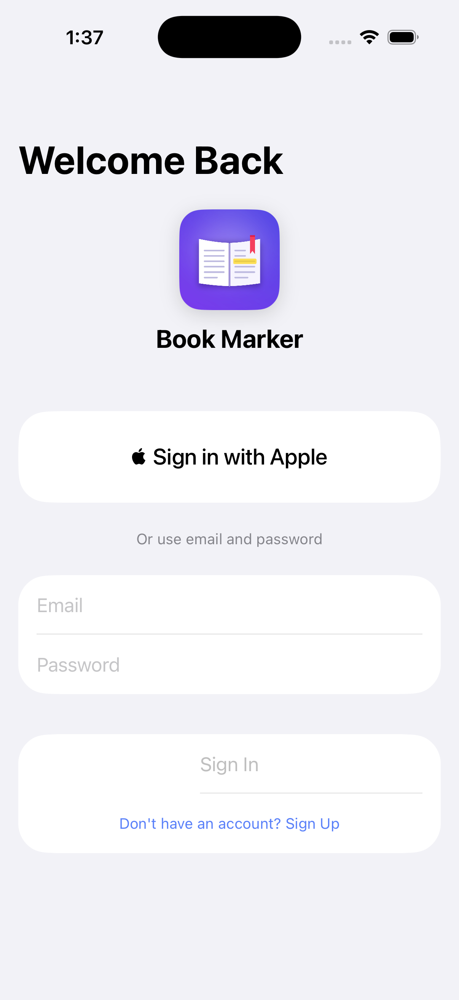
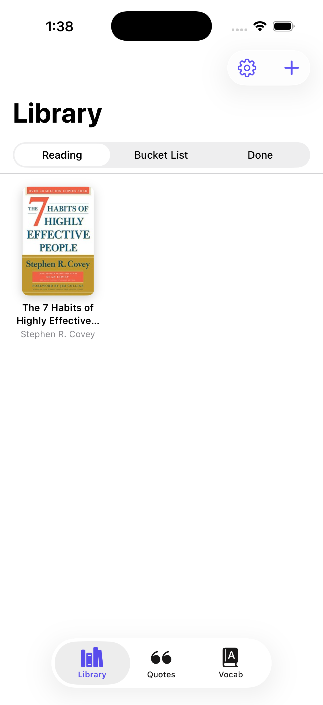
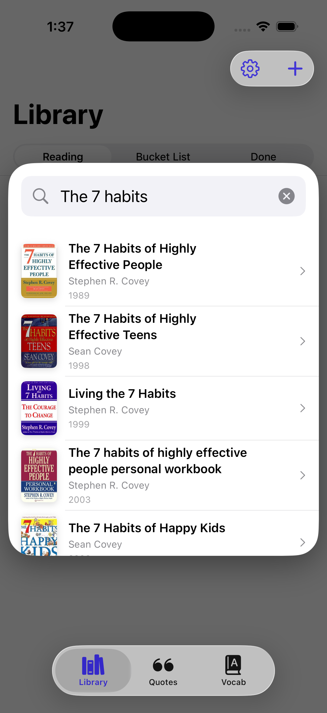
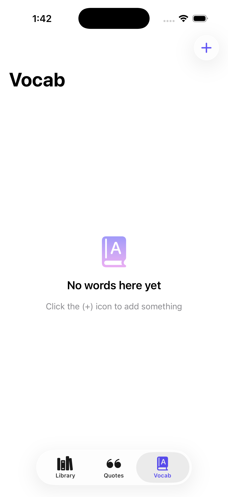

# Book Marker

A native iOS app for tracking what you read, capturing quotes straight from the page, and building a personal vocabulary list from your books.

Built with SwiftUI and SwiftData. It works fully offline, and an optional Supabase account syncs your library across devices.

## Screenshots

<table>
  <tr>
    <th>Login</th>
    <th>Home (Library)</th>
    <th>Book Search</th>
    <th>Vocab</th>
  </tr>
  <tr>
    <td></td>
    <td></td>
    <td></td>
    <td></td>
  </tr>
</table>

## Features

- **Library**: add books to *Reading*, *Bucket List*, or *Done* shelves. Covers are cached on the device.
- **Photo quote capture**: take a photo of a page, paint over a passage with the highlighter, and the app pulls out the highlighted text for you (Gemini, called through a Supabase Edge Function). You can also type quotes by hand.
- **Vocab**: save unfamiliar words. Definitions are fetched automatically from the Free Dictionary API.
- **Spotlight search**: one search box for books, quotes, and words.
- **Accounts and sync**: sign in with email/password or Sign in with Apple. Data lives in SwiftData on the device and syncs to Supabase in the background (last-write-wins, deletions sync too).

## Tech stack

| Layer | Technology |
|---|---|
| App | Swift, SwiftUI, SwiftData, iOS 17+ |
| Auth and database | Supabase (Postgres with row-level security, Auth) |
| Server logic | Supabase Edge Functions (Deno / TypeScript) |
| Quote extraction | Google Gemini (server-side only) |
| Book data | Open Library, Google Books, Internet Archive, Gutendex, Library of Congress, Europeana, HathiTrust |
| Definitions | [Free Dictionary API](https://dictionaryapi.dev/) |

## Security model

- The app only ever holds the Supabase **publishable** key. Row-level security is what protects each user's data (`supabase/migrations/0001_…`), and there are SQL tests for it in `supabase/tests/`.
- Private keys (Gemini, Google Books, Europeana) and all privileged operations live in Edge Functions. None of them ship in the app binary.
- Quote extraction requires sign-in and has per-user hourly and daily limits. Text fields have length limits enforced in the database.

## Project structure

```
Book Marker/
├── Models/              Book, Quote, VocabWord, PendingDeletion (SwiftData)
├── Services/
│   ├── BookProviders/   BookProvider protocol, BookSearchCoordinator, one file per provider
│   ├── AuthManager, SyncManager, QuoteExtractionService
│   └── OpenLibraryService, DictionaryService, CoverImageCache, Config
├── Utilities/           Cover view, logo, password policy
└── Views/
    ├── Library/         Shelves
    ├── Quotes/          Quote list, camera, highlight canvas
    ├── Vocab/           Word list and add-word form
    ├── Search/          Spotlight overlay, book detail sheet
    └── AuthView, SettingsView

supabase/
├── migrations/          Schema, RLS policies, grants, rate limits, keep-alive RPC
├── functions/           extract-quote, delete-account, search-google-books, search-europeana
└── tests/               RLS and account-deletion SQL tests

docs/                    Privacy policy site (GitHub Pages)
scripts/                 Supabase keep-alive, icon generator
tools/deploycheck/       Pre-deploy security and scalability scanner (Go)
```

## Supabase keep-alive

[`scripts/supabase_keepalive.sh`](scripts/supabase_keepalive.sh) runs every 3 days from [`.github/workflows/supabase-keepalive.yml`](.github/workflows/supabase-keepalive.yml). It pings the project so the Supabase free tier doesn't pause it for inactivity. Setup is described in [`DOCUMENTATION.md`](DOCUMENTATION.md) §16.

## Documentation

- [`DOCUMENTATION.md`](DOCUMENTATION.md): walkthrough of every feature and the code behind it
- [`tools/deploycheck/README.md`](tools/deploycheck/README.md): how to use the pre-deploy scanner

## Privacy policy

<https://ariq100.github.io/Book-Marker/privacy/> (source in [`docs/privacy/`](docs/privacy/index.html))
